

没什么太重要的事情，从NASA登月说起：

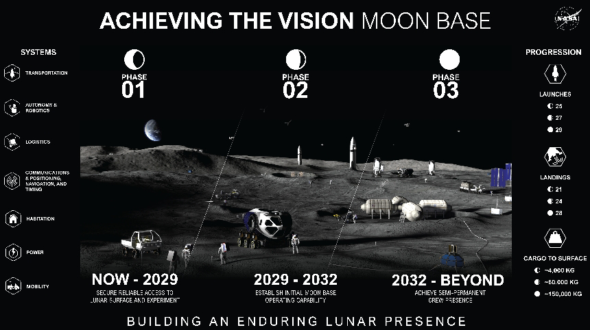

NASA发布了最新的登月计划，准备建立半永久的月球基地。

分为三步走，2029年之前实现初步技术验证，2029年到2032年部署模块化的居住舱，2032年以后建成基地。

和东大的类似计划相比，东大是打算2030年前载人登月，2035年基本建成。

所以假设两边都按计划来，西大大概领先两三年左右。

两边的选址都在南极，到了月亮上就是邻居，选在南极是因为那里有冰，资源丰富。

这个计划之前也有，现在最大的改变是把以前建设月球门户空间站的资源转向了，all in月球地面建设。

总投资大概两百亿美元，正好配合老马的商业航天上市。

这就像要办一场声势浩大的晚宴一样，在正式开始前要暖场，烘托气氛。

但是，天下没有免费的party，晚宴结束的时候，留在场子里的宾客就要买单了。

聪明的投资者可不会等到散场音乐响起来的时候才想起来退场。

——————————

美伊局势又生变数：

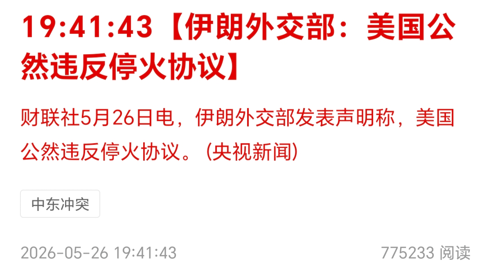

昨天大A盘前西大又把伊朗炸了。

不过西大说自己在“自卫反击”，不算破坏停火。

伊朗在晚间进行了回应，认为这个就是破坏停火。

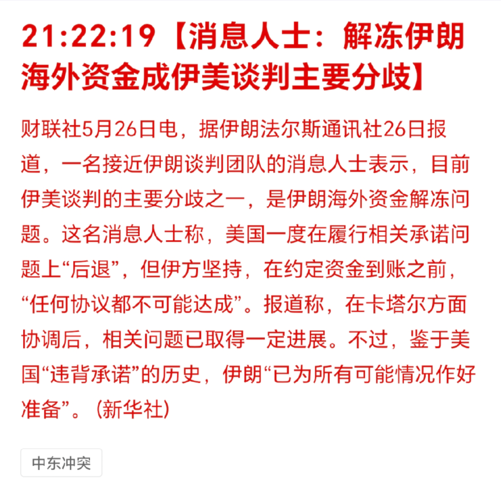

有消息称目前的主要分歧在钱什么时候到账上，伊朗不信任西大，坚持西大先打钱（解封的资产），再开海峡。

——————————

马来西亚对投资金条征收10%关税：

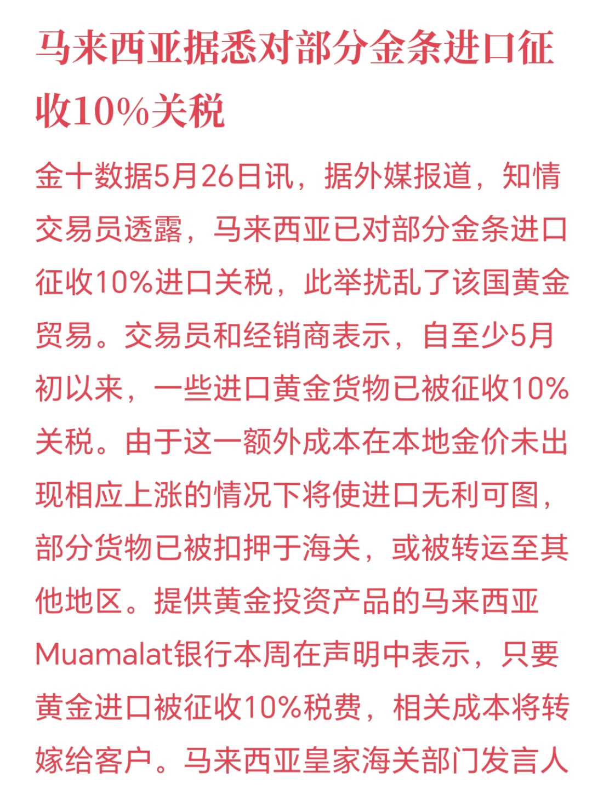

无论哪个国家，国民买投资黄金，就是做空本国货币。

当然买的人不一定会这么想，但是事实上会达到这个效果。

因为黄金就是信用货币的对立面。

同理，普通央行在世界货币体系里，就是普通参与者，而央行的央行，则是美联储。

其他央行买金，就是做空美元。

所以一般国家不会乐见本国国民疯狂买金，就像美联储也对其他央行买金的行为感到不爽一样。

一般这种新闻相当于减少黄金的需求，算是小小利空，马来西亚体量小，实质上没啥影响，更多的是情绪影响。

——————————

信通院发布了四月的手机销售数据：

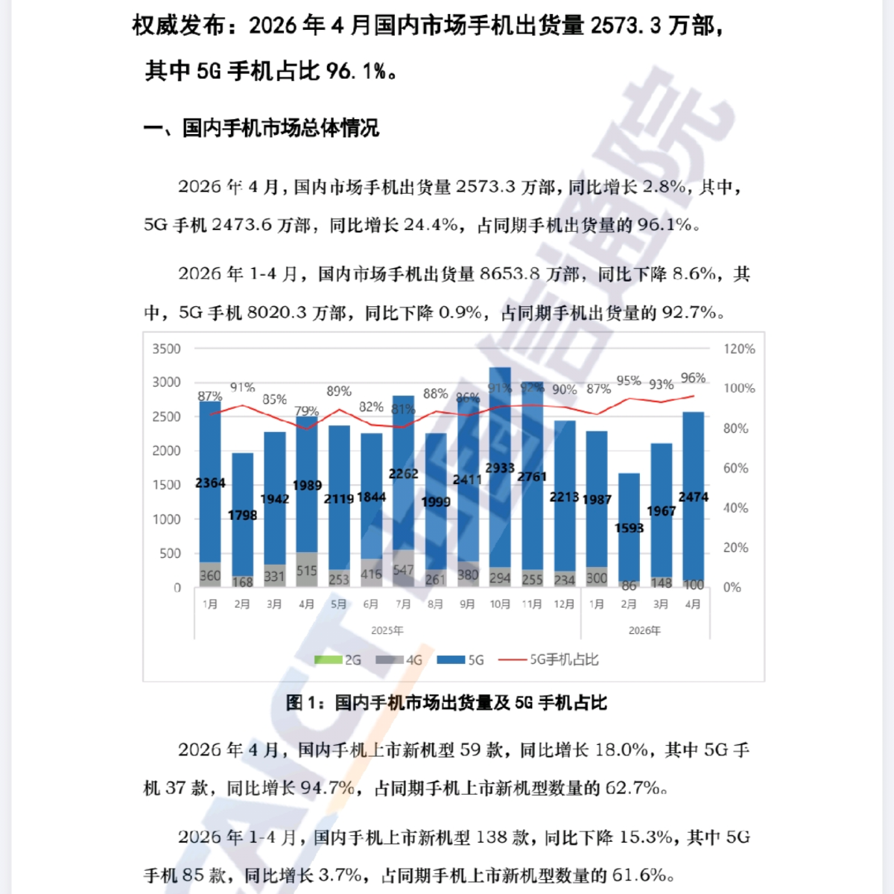

今年第一季度的数据很差，四月相对来说，数据相当不错的，总量是增长的，5G手机也是增长的。

要知道第一季度可是同比下跌的。

所以这可能提示<strong>消费电子</strong>行业可能有边际改善预期。

不过要提醒的是，因为ai导致存储价格上涨，今年手机厂家面临的困境是成本提升叠加销量下滑，属于困难模式，一个月的好转不代表处境的彻底改善，还是要继续观察618的情况的。

——————————

说到手机，刚好某手机厂商发布了一季报：

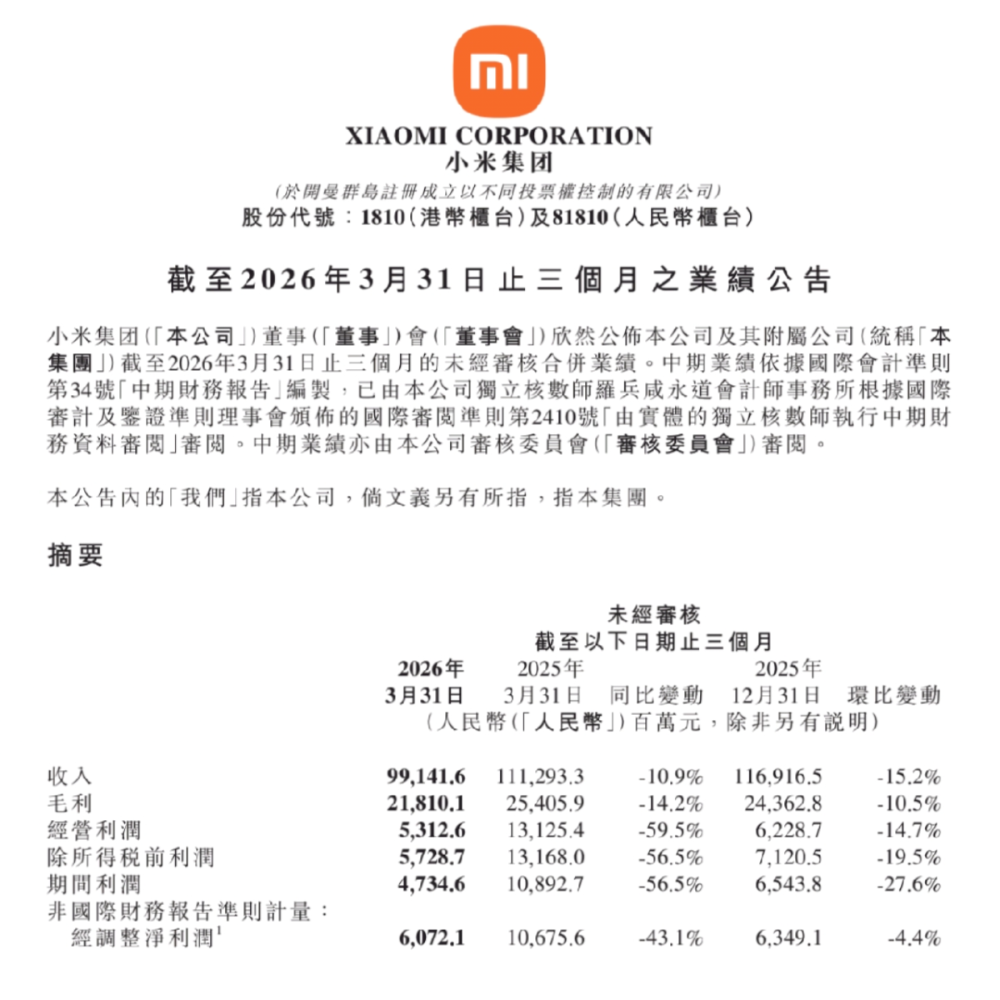

这个业绩，不理想。

营收下滑10%，净利下滑近6成。

一季度手机出货量下降了近两成，和信通院数据也基本对的上。

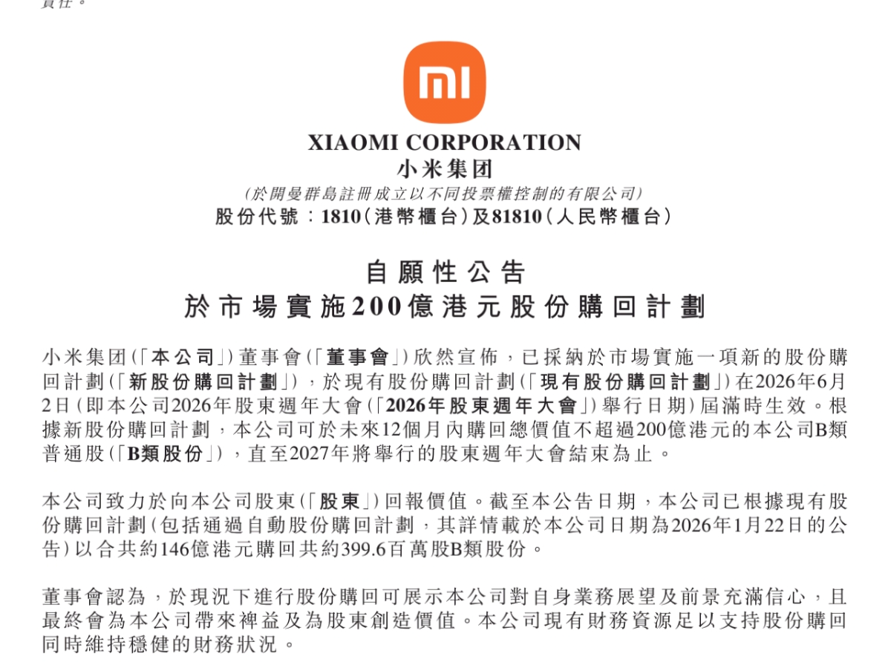

为了安抚市场情绪，该公司又抛出了一份<strong>不超过</strong>200亿的回购计划。

这个还是挺超预期的，就是不知道这个不超过200亿是怎么个不超过法，最后具体能落地多少。

我个人因为对电车和手机制造在中短期内的预期不乐观，所以是没有这两个行业的仓位的。

——————————

大宗商品：

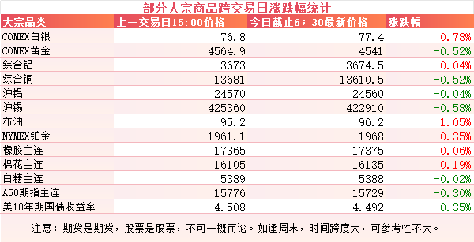

受消息面影响，原油价格有所抬升，涨了一个点。

有色波澜不惊，大部分都在一个点内正常波动，但是出现了分化：

白银和铂金强一些，黄金弱一些，铝强一些，铜弱一些。

昨天盘中伦铝创出阶段性新高，一度突破3700美元。

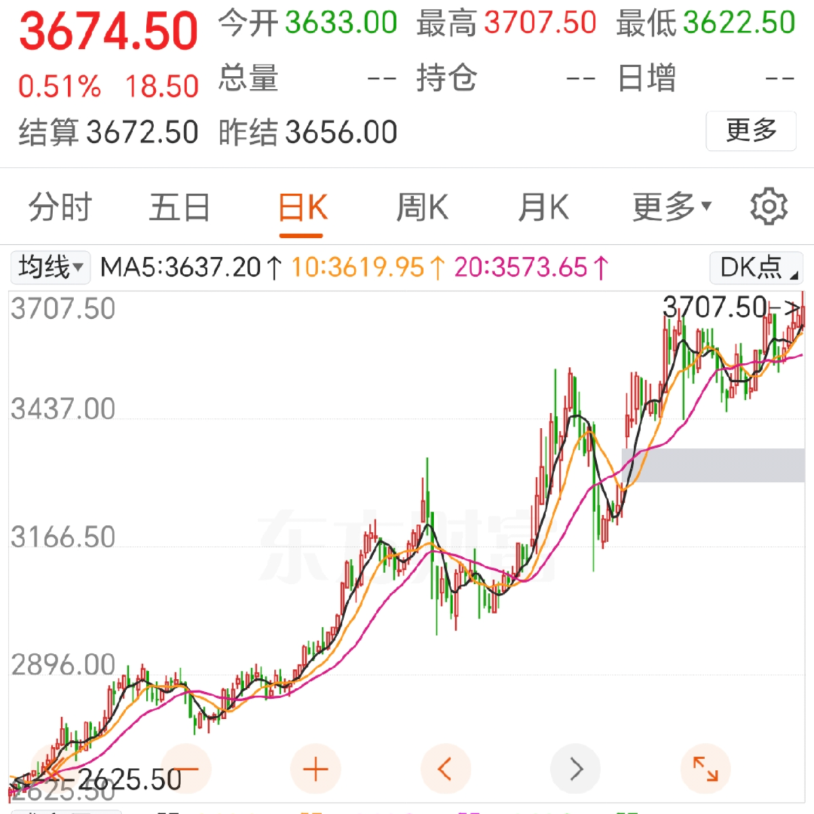

外围市场：

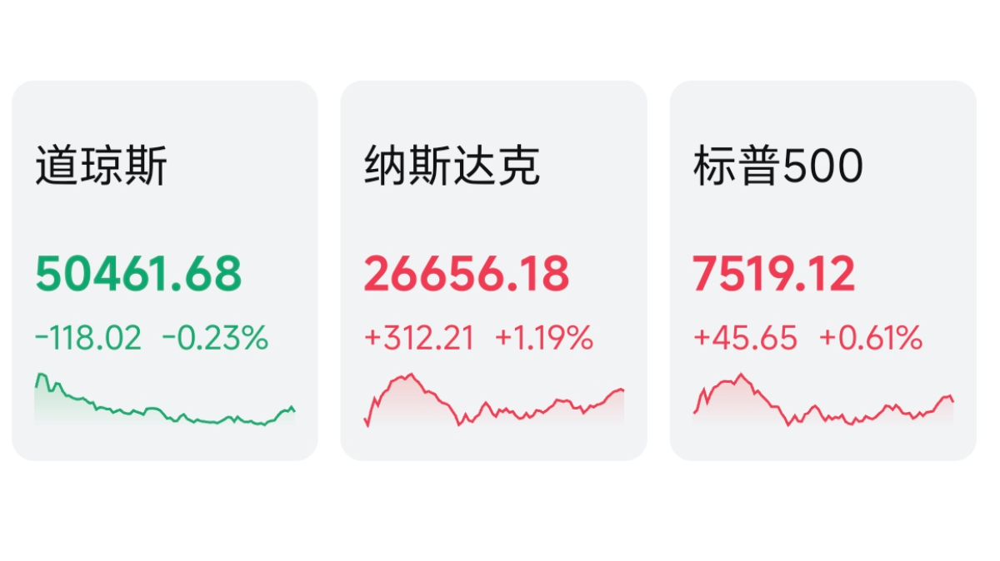

美三大股指涨跌不一，纳指领涨，道指回调。

板块上，存储走强，美光闪迪创新高，商业航天，银行也都表现不错。

——————————

昨天个人组合净值回血近一个点，银行没动，资源红五个半，消费红半个，算电绿了两个，电网绿了不少，让算力拉回来一些。

还可以，跑赢指数了起码。

被按在地上的老登终于抬起头喘了口大气。

至于这到底是风格的转换，还是中场休息，就不太好说了，一两天的行情看不出什么端倪。

——————————

电解铝小作文：

有消息称第五生态环境保护督察入驻广西，进驻时间：2026年5月9日-6月9日，为期1个月。

督查重点是"两高一低"项目管控及4500万吨电解铝产能红线执行。

广西有大约300万吨电解铝产能，其中百色大概有240万吨。

目前还没通报查到的具体问题，但是相关企业已经主动降负配合检查，有传闻称铝水产能降低不少。

接下来的六月是工信部的排查，很多企业都会降负配合检查，可能铝水产能会继续下滑。

——————————

化肥行业小作文：

有传言称化肥配额正在摸底，可能在适当时机分配出口配额。

——————————

目前各行业估值情况：

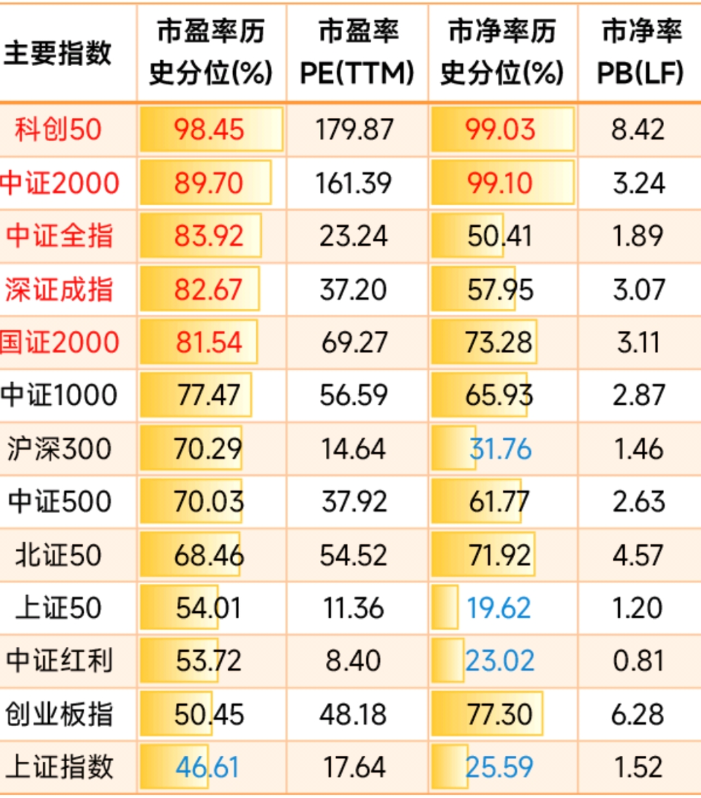

科创50，中证2000的市净率百分位已经超过99%了，比历史上99%的时间都贵。

当然也可以理解成还没到100%，还有提升空间。

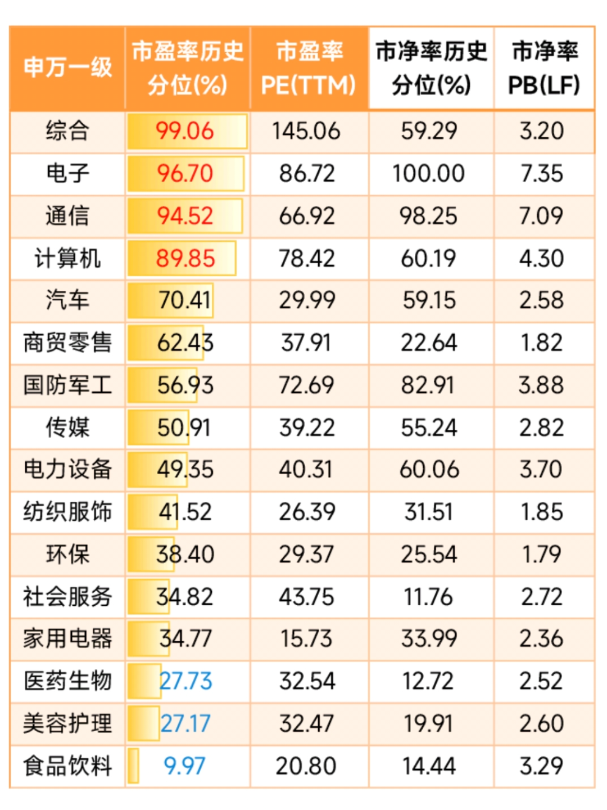

行业方面，科技类市盈率分位都在90%以上，食品饮料在10%以下，非常极端。

电子行业的市净率历史分位来到了惊人的100%，历史最贵。

也不意味着就一定怎么样，比如科技类市盈率历史分位还可以冲击100%，食品饮料还可以冲击1%，这也不是说就没可能。

但是历史规律的话，一般这种情况，拉长了看，均值回归的趋势可能会更大一些。

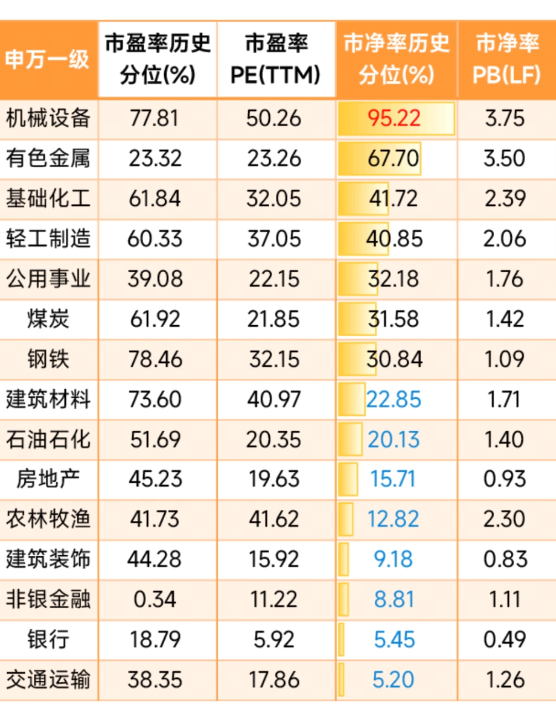

银行和交通运输的市净率百分位来到了5点几，比历史上9成5的时间内都更便宜。

画风差距最大的是有色，看市净率，比历史上三分之二的时间内都更贵，但是看市盈率，比历史上近8成以内的时间都更便宜。

所以对有色的估值模式，决定了现在有色到底是高估还是低估。

我个人的看法，现在是有色从市净率估值转向市盈率估值的一个阶段。

因为现在的有色，和历史上任何时期都不同，成本占比已经越来越低，周期变化已经从盈利——亏损——盈利的周期变成了暴利——微利——暴利的周期。

只要这样的循环多来几次，金属持续保持高位，市场会越来越把估值模式从PB切换成PE。

一旦认可了PE的估值模式，那现在23的历史分位估值水平并不高。

——————————

一个喜欢保护韭菜的博主，希望大家少少踩坑，多多赚钱！！！

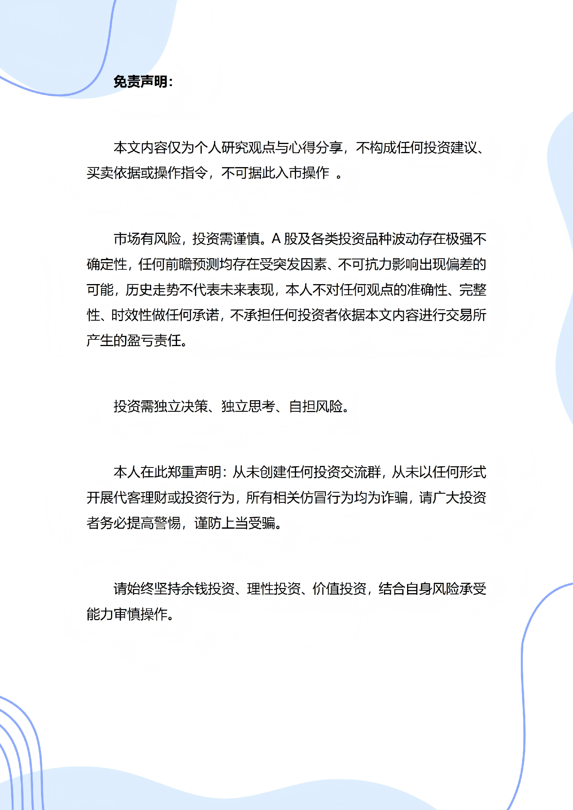

<h2>💬 评论区</h2>

Dean 昨天 07:01

佬 昨天说到国家队腾出手来了，那如果现在大回调的话，抄底有哪些方向吗？

MR Dang这个我替他们做不了主，但是红利板块一般是长线资金偏好的方向，应该不会帮助半导体老板们减持吧。。。

limeng1976半导体方面，国家队都是混一级市场的吧，各类政府投资基金

同花顺黑铁选手 昨天 07:04

不善择时，锡是一点没卖，逢低就买，感觉50w的大关并不遥远了

MR Dang你是有信念的

九月这不是单挑吧？

子午线 昨天 07:04

化肥配额是利好还是利空

MR Dang落地的越早越好

西红柿炒番茄 昨天 07:05

老师 怎么看cb取消了减持   一股没减？

MR Dang不是蠢就是坏，不是好鸟

顶花带刺丶小黄瓜CB是菜市场百货？

风之罗盘这支股票我从跌停接起，到现在亏了20多个点。
幸好只买了1万

灰马最坏的就是大幅减少分红

顶花带刺丶小黄瓜管理层坏的公司，就拉黑了，

万有引力大股东取消减持，对散户不是利好吗

多财多亿我也是，不过我买了两万多，气死了。再也不买这支股票了，这些垃圾

道白指不定有人就趁这个时候抄底了…

焚琴煮鹤戏无盐你简直是疯了....年报出来以后股息率变低了那么多，怎么看都不可能接盘啊...

晨1021取消减持不是利好吗？

摸鱼但是这说明他前期公布减持是损人不利己，钱没赚到股价还下来了。一般坏人有公布增持结果没增的。

晴对啊，他这么搞损人不利己，还这么搞？真没懂啥意思！不过感觉到底位了，可以入手了吧

风之罗盘我就看跌了10%,脑袋一热,以为打9折就冲了

焚琴煮鹤戏无盐可惜可惜 还好金额不多

雪雪雪y 昨天 07:05

老师早安，昨天回了一口老血，话说农茅能不能采购点？

土豆 昨天 07:05

早啊，老师

漫漫 昨天 07:06

老师的算电是什么

MR Dang之前有文章，可以搜下关键词

泰格把咱哥又电麻了🙈

风之罗盘 昨天 07:07

老师老师，又打起来了，可以买煤化工么？

MR Dang短期博弈没有一手消息谨慎参与，长期投资锚定股息率更好

风之罗盘谢谢老师

焚琴煮鹤戏无盐现在这个股息率应该还不太有吸引力吧

顶花带刺丶小黄瓜 昨天 07:07

表头的申万一级是啥意思？

MR Dang行业分类标准，申万一级是国内共识最高的行业分类标准

顶花带刺丶小黄瓜收到🤗

乘风破浪的波妞酱 昨天 07:09

老师算力拿的什么呢？昨天dyg跌了近四个点啊

MR Dang大多数是跌的，有一个涨的多的。。

MrLittleCold老师配置了当红炸子鸡？

暮秋廿一之前的文章提到了4个吧，涨得多的那应该是lt了

hongliangltdz涨了不少啊

泰格天天卡异动，这谁受得了

飞鱼贵还是有贵的道理  我的三个字的算是中绿    感觉不强。

钟情过期酸奶 昨天 07:09

在4500万吨限制的铝和越开采越少的金铜锡之下，感觉资源股更像成长股，半导体反而像周期股。。

still 昨天 07:09

D大，铜王的逻辑还在吗

闲云野贺多少人拍大腿29.*没有接

云海 昨天 07:09

佬，能接回云姐儿吗？

钱德勒你这名起的～

fighting 昨天 07:10

大佬，这次行情会不会跟以前不一样，像纳斯达克一样，走出长牛？还是继续延续祖训啊，牛短熊长？

MR Dang这个预测不来，老股民很少有敢奢望长牛的，主要是融资市就没有长牛的流动性基础

快乐的大大科技股密集上市完是不是意味着大顶即将到来？

快乐的大大两存上市完，我是打算保守操作l q

Marchisio.卜（豆豆）长牛要个股都注重股东回报，百花齐放，现在这个集中度都在高PE抱团，个人倾向于还是想击鼓传花，干一票大的。

柚子皮大 a 不太可能，过几年还会回到他该有的位置的

研道保守操作意思是要清仓吗？

魔山_M我个人见解：在中期选举前，美股相当比较安全，还有两个巨头要上市，政策不允许，经济也不允许，十月份见真章

快乐的大大是的留现金去抄底

啦啦啦大神 昨天 07:10

dang大 现在亏15%今年 只有银行半仓目前，今年不求盈利了只求回本，不想回铝，还有什么好去处吗

MR Dang可以参考后面发的估值图，找一些低估的方向。但是低估的方向有可能继续低估，需要做好心理准备

大A战士久留美你说今年回本，相当于就是在当前的基础上盈利17%。怎么说呢，当前这个市场位置下，难度很大，若是执念太深，容易操作变形

飞鱼求回本 确定性高一点的感觉还是有色  。。。虽然天天挨打  但确实价格比较美丽   市场供需逻辑摆着。只是要有耐心

啦啦啦大神但是跌的很顺利，铜铝银行差不多占了跌幅的60%。。你说的对 操作变形，铝要么早割要么装死，结果割在了相对低点

啦啦啦大神你说的也没错，但是严格纪律的话，有色板块不超过25%，想要靠这个回本，那涨幅要接近100%，如果单调有色，那有变成之前的错误了，重仓铝

飞鱼还是保持比例。电力设备   绿色电力 个人觉得还好。。

hectorhua 昨天 07:10

今日无打野内容，鉴定完毕

晴Only.哈哈

发财猫猫 昨天 07:13

谁有小甜水的链接啊，想入手一点😋

MR Dang现在不好买了，可以买点国产的平替，比如张裕的也还行

茯苓饮这是啥

发财猫猫红酒

发财猫猫好的，这就去看看😋

一个小目标 昨天 07:13

梭哈食品饮料

non-solution 昨天 07:14

[图片] dang大会薅恒顺醋业的羊毛吗

MR Dang会，100股问题不大，哈哈

HuaMax啥意思，咋薅同学

non-solution去小红书搜，有的兄弟

Wang6！

阿里官方公众号有介绍

凌顷必须支持 不为酸的 只为了恒顺

